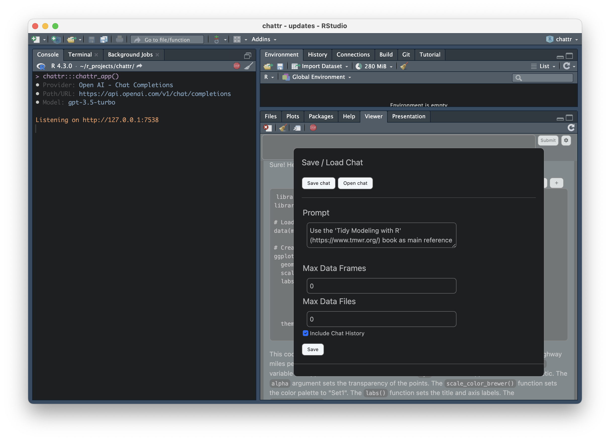

# chattr

<!-- badges: start -->

[](https://github.com/mlverse/chattr/actions/workflows/R-CMD-check.yaml)
[](https://app.codecov.io/gh/mlverse/chattr?branch=main)
[](https://CRAN.R-project.org/package=chattr)
[](https://lifecycle.r-lib.org/articles/stages.html#experimental)

<!-- badges: end -->


<!-- toc: start -->

-   [Intro](#intro)
-   [Install](#install)
-   [Available models](#available-models)
-   [Using](#using)
    -   [The App](#the-app)
    -   [Additional ways to interact](#additional-ways-to-interact)
-   [How it works](#how-it-works)
-   [Keyboard Shortcut](#keyboard-shortcut)
    -   [How to setup the keyboard
        shortcut](#how-to-setup-the-keyboard-shortcut)

<!-- toc: end -->

## Intro

`chattr` is an interface to LLMs (Large Language Models). It enables
interaction with the model directly from the RStudio IDE. `chattr`
allows you to submit a prompt to the LLM from your script, or by using
the provided Shiny Gadget.

`chattr`’s main goal is to aid in EDA tasks. The additional information
appended to your request, provides a sort of “guard rails”, so that the
packages and techniques we usually recommend as best practice, are used
in the model’s responses.

## Install

Since this is a very early version of the package install the package
from Github:

``` r
remotes::install_github("mlverse/chattr")
```

## Available models

`chattr` provides two main integration with two main LLM back-ends. Each
back-end provides access to multiple LLM types:

<table>
<colgroup>
<col style="width: 25%" />
<col style="width: 48%" />
<col style="width: 25%" />
</colgroup>
<thead>
<tr class="header">
<th style="text-align: center;">Provider</th>
<th style="text-align: center;">Models</th>
<th style="text-align: center;">Setup Instructions</th>
</tr>
</thead>
<tbody>
<tr class="odd">
<td style="text-align: center;"><a
href="https://platform.openai.com/docs/introduction">OpenAI</a></td>
<td style="text-align: center;">GPT Models accessible via the OpenAI’s
REST API. <code>chattr</code> provides a convenient way to interact with
GPT 3.5, and DaVinci 3.</td>
<td style="text-align: center;"><a
href="https://mlverse.github.io/chattr/articles/openai-gpt.html">Interact
with OpenAI GPT models</a></td>
</tr>
<tr class="even">
<td style="text-align: center;"><a
href="https://github.com/kuvaus/LlamaGPTJ-chat">LLamaGPT-Chat</a></td>
<td style="text-align: center;">LLM models available in your computer.
Including GPT-J, LLaMA, and MPT. Tested on a <a
href="https://gpt4all.io/index.html">GPT4ALL</a> model.
<strong>LLamaGPT-Chat</strong> is a command line chat program for models
written in C++.</td>
<td style="text-align: center;"><a
href="https://mlverse.github.io/chattr/articles/backend-llamagpt.html">Interact
with local models</a></td>
</tr>
</tbody>
</table>

The idea is that as time goes by, more back-ends will be added.

## Using

### The App

The main way to use `chattr` is through the Shiny Gadget app. By
default, it runs inside the Viewer pane:

``` r
chattr::chattr_app()
```


After the LLM finishes its response, the `chattr` app processes all
markdown code chunks. It will place three convenience buttons:

-   **Copy to clipboard** - It will write the code inside the chunk to
    your clipboard.

-   **Copy to document** - It will copy-paste the code directly to where
    the app was called from. If the app is started while working on a
    script, `chattr` will copy the code to that same script.

-   **Copy to new script** - It creates a new R script in the RStudio
    IDE, and copies the content of the chunk directly to it. Very useful
    when the LLM writes a Shiny app for you

A lot of effort was put in to make the app’s appearance as close as
possible to the IDE. This way it feels more integrated with your work
space. This includes switching the color scheme based on the current
RStudio theme being light, or dark.

The settings screen can be accessed by clicking on the “gear” button.
The screen that opens will contain the following:

-   Save and Open chats - This is an early experiment to allow us to
    save and retrieve past chats. `chattr` will save the file in an RDS
    format. The main objective of this feature, is to be able to see
    past chats, not to continue previous conversations with the LLM.

-   Prompt settings - In this section you can change the additional
    information attached to your prompt. Including the number of max
    data files, and data frames sent to the LLM.



### Additional ways to interact

Apart from the Shiny app, `chattr` provides two more ways to interact
with the LLM. For details, see: [Other
interfaces](https://mlverse.github.io/chattr/articles/other-interfaces.html)

## How it works

`chattr` enriches your request with additional instructions, name and
structure of data frames currently in your environment, the path for the
data files in your working directory. If supported by the model,
`chattr` will include the current chat history.


To see what `chattr` will send to the model, set the `preview` argument
to `TRUE`:

``` r
library(chattr)

data(mtcars)
data(iris)

chattr(preview = TRUE)
#> 
#> ── chattr ──────────────────────────────────────────────────────────────────────
#> 
#> ── Preview for: Console
#> • Provider: Open AI - Chat Completions
#> • Path/URL: https://api.openai.com/v1/chat/completions
#> • Model: gpt-3.5-turbo
#> • temperature: 0.01
#> • max_tokens: 1000
#> • stream: TRUE
#> 
#> ── Prompt:
#> role: system
#> content: You are a helpful coding assistant
#> role: user
#> content:
#> * Use the 'Tidy Modeling with R' (https://www.tmwr.org/) book as main reference
#> * Use the 'R for Data Science' (https://r4ds.had.co.nz/) book as main reference
#> * Use tidyverse packages: readr, ggplot2, dplyr, tidyr
#> * For models, use tidymodels packages: recipes, parsnip, yardstick, workflows,
#> broom
#> * Avoid explanations unless requested by user, expecting code only
#> * For any line that is not code, prefix with a: #
#> * Keep each line of explanations to no more than 80 characters
#> * DO NOT use Markdown for the code
#> [Your future prompt goes here]
```

## Keyboard Shortcut

The best way to access `chattr`’s app is by setting up a keyboard
shortcut for it. This package includes an RStudio Addin that gives us
direct access to the app, which in turn, allows a **keyboard shortcut**
to be assigned to the addin. The name of the addin is: “Open Chat”. If
you are not familiar with how to assign a keyboard shortcut see the next
section.

### How to setup the keyboard shortcut

-   Select *Tools* in the top menu, and then select *Modify Keyboard
    Shortcuts*

    

-   Search for the `chattr` adding by writing “open chat”, in the search
    box

    

-   To select a key combination for your shortcut, click on the Shortcut
    box and then type *press* the key combination in your keyboard. In
    my case, I chose *Ctrl+Shift+C*

    
